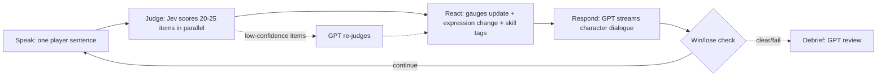

# Srake — PRD & Business Plan

*Speak and Break: a persuasion-training game where you talk your way through the door*

Sep 26, 2026 · @Seungjun Oh

## Summary

Srake is a web game for persuasion training where every sentence you say is scored in real time. Players clear stages by talking a security guard, an investor, or a friend about to go all-in on a coin into changing their mind.

- **Problem**: Persuasion is a skill built through repetition and instant feedback, yet there is no safe place to practice. Existing AI roleplay tools are mostly built for B2B sales teams and sold per seat.
- **Solution**: Jev judges every utterance against 20–25 research-based rubric items instantly, moving the gauges and the character's facial expression. An OpenAI GPT model handles character dialogue and the post-stage debrief.
- **Why Jev**: Each round requires 8–12 utterances × 20+ items judged in real time. A general LLM is too slow and too expensive for this.
- **Why now**: A System One model (Jev) launched this month, making sentence-level real-time judgment nearly free.
- **Hackathon goal**: The Gate mode with 3 stages fully playable, The Pitch mode with 1 stage, and one scoring-agreement validation number.
- **North-star metric**: Stages cleared per user per week (= amount of deliberate practice).

## Problem and Target Users

What people lack is not persuasion knowledge but a practice loop where they can fail safely and learn why immediately. The initial target is college students and early-career professionals whose grades and careers depend on persuasion but who have no way to practice it.

| Persona | When they need to persuade | What they want | Current alternative |
| --- | --- | --- | --- |
| Job-seeking college student (20–24) | Interviews, internship applications, networking | Speak logically under pressure | YouTube, study groups, mock interviews |
| Student founder | Pitches, hackathons, fundraising | Stay steady under investor questioning | Rehearsing in front of friends |
| Non-native English speaker | University debates, work meetings | Persuade convincingly in English | Conversation apps |
| Junior sales or marketing hire (expansion) | Handling customer objections | Turning a no into a yes | Internal training, sales roleplay tools |

Limits of existing alternatives:

- **Books and courses**: Teach principles but offer no repetition or feedback.
- **Rehearsing with people**: Feedback is subjective, and you have to ask someone every time.
- **AI sales roleplay tools**: Focused on sales-call scenarios and sold by enterprise seat. Weak motivation design for individuals practicing for fun.
- **Asking a general chatbot to roleplay**: No scoring system, slow judgment, and inconsistent criteria each time.

## Product Overview and Core Loop

Each turn has four steps — Speak → Judge → React → Respond — and the gauges and expression must react within 700ms of the utterance. The gap where judgment (reflex) arrives before dialogue (thought) is the product's core feel.



Division of roles:

- **System 1 — Jev**: All judgments. Returns typed options and probabilities. Fast, cheap, and never generates free text.
- **System 2 — OpenAI GPT**: Character dialogue, end-of-stage debrief, "what you could have said" alternatives, and interpreting creative strategies the rubric doesn't cover.
- **Cascade rule**: GPT re-judges a core item only when Jev's probability falls between 0.35 and 0.65. Target: under 10% of all judgments escalate to GPT.

Win/lose structure: every mode has two gauges (progress / risk) and a turn limit. Pushing hard raises both progress and risk, so players constantly trade speed against trust.

## Mode Design

The three modes differ not just in character but in the persuasion route they train: the peripheral and central routes of the Elaboration Likelihood Model (ELM), and self-persuasion from Motivational Interviewing.

| Mode | Persuasion route | Skill trained | Research basis | Progress / risk gauges | Win | Lose |
| --- | --- | --- | --- | --- | --- | --- |
| 1. The Gate (security guard) | Peripheral | Using influence cues | Cialdini's 7 principles, Langer (1978) "because" study, foot-in-the-door, "but you are free" technique | Door open / suspicion | Door open reaches 100 | Suspicion hits 100 or 8 turns used |
| 2. The Pitch (investor) | Central | Argument quality | Toulmin model of argument, Chen, Yao & Kotha (2009) VC study: preparedness over passion | Conviction / skepticism | Conviction reaches 100 → term sheet | Skepticism hits 100 or 10 turns used |
| 3. The Intervention (coin friend) | Self-persuasion | Moving people without pushing | Motivational Interviewing, MITI 4.2 coding, Brehm's reactance theory | Willingness to change / reactance | Friend states a commitment on their own | Reactance hits 100 or 12 turns used |

Stage characters:

| Mode | Stage 1 | Stage 2 | Stage 3 (boss) |
| --- | --- | --- | --- |
| The Gate | Tired night-shift guard: soft on liking and emotion, backfires on shows of authority | Rulebook devotee: responds to authority and evidence, unmoved by emotional appeals | Ex-detective: only consistency and verifiable detail work, hypersensitive to exaggeration |
| The Pitch | Friendly angel: looks at problem and team | Numbers-obsessed VC: market, traction, unit economics | Skeptical partner meeting: risks, competition, handling objections |
| The Intervention | Friend on the fence | Friend already convinced | Defensive friend annoyed by any advice |

Shared character structure:

- **Personality weight vector**: how well each rubric item works on this character (+/−).
- **Hidden concern**: e.g., the night guard fears getting fired after one more mistake. Players earn big points for uncovering it through questions and resolving it. This rewards listening over talking.
- **Voice and verbal tics**: fixed in the GPT system prompt.

Swapping character config on the same engine adds new modes: interviewer, salary negotiation, convincing parents, English debate. The marginal cost of a new mode is content writing only.

## Measurement System: Srake Scoring Engine

Each utterance is judged on about 25 items across 4 layers. Items are many, but each is a Yes/No, a choice, or an ordered rubric whose every level has a written description. More items add richness; unanchored 1–10 scales add disagreement.

| Layer | Role | Items | Applies to |
| --- | --- | --- | --- |
| L1 Core | Core skills tied directly to each mode's theory | 7–9 | Per mode |
| L2 Style | Delivery common to all persuasion | 7 | All modes |
| L3 Creativity | Catch and reward creative persuasion beyond the rubric | 7 | All modes |
| L4 Risk | Fouls, repetition, safety | 7 | All modes |

### L1 Core — The Gate

| Code | Question | Type |
| --- | --- | --- |
| G1 | Did the player give a reason ("because") for the request? | Yes/No |
| G2 | Which influence principle was used? (reciprocity, consistency, social proof, authority, liking, scarcity, unity, none) | Choice |
| G3 | Does the claim include a concrete, verifiable detail? | Yes/No |
| G4 | Did the player explicitly acknowledge the guard's freedom to choose? | Yes/No |
| G5 | Is the request smaller, the same, or bigger than the previous one? | Choice |
| G6 | Did the player ask a small question the guard can easily say "yes" to? | Yes/No |
| G7 | Does the proposal reduce the guard's job burden (responsibility, reporting)? | Yes/No |

### L1 Core — The Pitch

| Code | Question | Type |
| --- | --- | --- |
| I1 | Is there a clear claim? | Yes/No |
| I2 | What kind of evidence? (quantitative data, customer evidence, sourced citation, anecdote, none) | Choice |
| I3 | Did the player connect why the evidence supports the claim? | Yes/No |
| I4 | Did the player directly answer the investor's last question? | Yes/No |
| I5 | Did the player acknowledge a risk or limitation unprompted? | Yes/No |
| I6 | Did the player pre-empt a likely objection? | Yes/No |
| I7 | Which pitch element was covered? (problem, solution, market, traction, business model, competition, team, ask) | Choice |
| I8 | Did the player state the source or derivation of numbers? | Yes/No |
| I9 | Did the player translate into investor language (returns, risk, exit)? | Yes/No |

### L1 Core — The Intervention

| Code | Target | Question | Type |
| --- | --- | --- | --- |
| M1 | Player | Utterance type? (open question, closed question, simple reflection, complex reflection, affirmation, information with permission, persuading without permission, confronting) | Choice |
| M2 | Player | Did the player emphasize the friend's autonomy? | Yes/No |
| M3 | Player | Is it a request to think it through together? | Yes/No |
| F1 | Friend's reply | Change talk, sustain talk, or neutral? | Choice |
| F2 | Friend's reply | Type of change talk? (desire, ability, reasons, need, commitment, activation, taking steps) | Choice |

### L2 Style (all modes)

| Code | Question | Type |
| --- | --- | --- |
| S1 | Is there one clear core request or claim? | Yes/No |
| S2 | Is it concise, without filler? | Yes/No |
| S3 | Did the player build specifically on the other side's last line? | Yes/No |
| S4 | Question form? (open, closed, rhetorical, none) | Choice |
| S5 | Did the player use concrete numbers, names, or scenes instead of abstractions? | Yes/No |
| S6 | Emotional tone? (warm, neutral, firm, pleading, aggressive) | Choice |
| S7 | Did the player acknowledge the other side's position or feelings? | Yes/No |

### L3 Creativity (all modes)

| Code | Question | Type |
| --- | --- | --- |
| C1 | Did the player naturally combine two or more persuasion principles? | Yes/No |
| C2 | Is this a new angle, different from the list of common approaches for this character? | Yes/No |
| C3 | Did the player reframe the problem? e.g., "open the door" → "let me make your report easier" | Yes/No |
| C4 | Did the player use a short story or scene? | Yes/No |
| C5 | Did the player use tension-breaking humor? | Yes/No |
| C6 | Action on the hidden concern? (probing question, direct resolution, unrelated) | Choice |
| C7 | Principle tag is "none" but the expected effect is positive? → flag as "unclassified creative strategy" for GPT to analyze | Yes/No |

C2's list of common approaches is refreshed weekly from frequent strategies in accumulated play logs. C7 is the safety net that keeps the rubric from missing creativity. GPT names and explains the new strategy; if it recurs, it is promoted to a formal item.

### L4 Risk (all modes)

| Code | Question | Type | Effect |
| --- | --- | --- | --- |
| R1 | Is it a threat or intimidation? | Yes/No | Risk gauge spikes |
| R2 | Is it a bribe or money offer? | Yes/No | Risk spikes |
| R3 | Is it a false identity or unverifiable authority claim? | Yes/No | Risk rises |
| R4 | Does it repeat earlier logic? | Yes/No | Progress decays |
| R5 | Is it off-topic? | Yes/No | Wasted turn |
| R6 | Is it a personal attack or rude? | Yes/No | Risk rises |
| R7 | Is it harmful content outside the game? (safety filter) | Yes/No | Turn voided, warning |

### Scoring Formula

For each item i: p = Jev probability, w = character weight (can be negative), r = risk weight.

```latex
\Delta \text{Progress} = \Big(\sum_i w_i^{(c)} \, p_i\Big) \times M_{\text{combo}} \times 0.6^{\,k-1}
```

```latex
\Delta \text{Risk} = \sum_j r_j^{(c)} \, p_j
```

- M\_combo: 1.5 when C1 is met, 1.2 after three positive turns in a row (stackable).
- 0.6^(k−1): repetition decay when a principle is used for the k-th time.
- Example character weights for G2 principles: the night guard has liking +1.2, authority −0.5. The ex-detective has liking +0.2, consistency +1.0, authority +0.3.

### Judgment Prompt Format

Each item is sent with a definition, one positive example, one borderline negative example, and character context (last 2 turns, personality, hidden concern). Borderline example for G1: "Because I need to get in" only restates the request, so it does not count as a reason.

### Validation

1. Golden set: two people independently label 40 utterances per mode.
2. Measure human–human agreement (Cohen's kappa) first. Rewrite or drop items that humans themselves disagree on.
3. Measure Jev's agreement with the consensus human label. Pass bar: 80%+ on core items.
4. Calibration: check by bucket that Jev's 0.8 judgments are right about 80% of the time.
5. Put one line on the demo slide: "Jev–human coder agreement: X%".

## Gamification

Game mechanics exist only to make people practice better persuasion more often; nothing rewards gaming the score.

| Mechanic | Rule | Learning purpose |
| --- | --- | --- |
| Live gauges + expressions | React within 700ms of every utterance | Instant feedback |
| Time limit | Per-turn countdown (default 30s) and optional session timer; time runs out = the character loses patience (risk +10) | Think and speak under real pressure |
| Skill tag pop-ups | "+12 Reciprocity", "−8 Repetition", "Critical: hidden concern resolved" | Internalize principle names |
| Combo | Principle combination ×1.5, three positive turns in a row ×1.2 | Practice combining strategies |
| 3-star rating | Clear / turn efficiency / zero risk fouls | Short, clean persuasion |
| XP and levels | XP for clears, first-time principles, reading the feedback report | Build the review habit |
| Skill tree | Mastery per Cialdini principle, argument skill, and MI competency based on use count and success rate | Make weaknesses visible |
| Streak | One stage per day | Spaced repetition |
| Daily challenge | Character of the day + a constraint (e.g., "no authority", "questions only") | Break comfortable habits, train creativity |
| Leaderboard | Ranked by fewest turns or fastest clear, not raw score; friends and school level | Efficiency competition |
| Highlight card | Shareable image of a critical line and the character's reaction | Virality |
| Boss stage | Third character in each mode | Goal setting |

Time-limit modes:

- **Normal**: 30 seconds per turn. When time runs out, the turn is skipped and the character gets impatient.
- **Rush**: whole stage in 3 minutes, no per-turn limit. Tests fast thinking under pressure, like a real elevator pitch.
- **Practice**: no timer, for beginners and non-native speakers.

Anti-gaming design (Goodhart's law):

- **Repetition decay and turn/time limits**: recycling the same line loses points quickly.
- **Per-character weights**: no universal line works on every character.
- **Hidden concern**: big points only come from understanding the other side.
- **Daily constraints**: block favorite strategies to widen the player's repertoire.
- **Character memory**: on a retry, the character reacts to repeated tactics ("You said that last time").

### End-of-Session Feedback (LLM)

After each stage, GPT writes a feedback report from the full transcript plus Jev's judgment log for every turn. Jev supplies the numbers; GPT supplies the interpretation.

- **Verdict**: one line on why the player won or lost.
- **Best moment**: the strongest line, and which principle made it work on this character.
- **Top 3 mistakes**: each quoted, with why it failed and a rewritten alternative ("what you could have said").
- **Stats**: principles used, reflection-to-question ratio (Intervention), evidence types (Pitch), time per turn.
- **Next drill**: one concrete thing to try on the next attempt, e.g., "Find the guard's hidden concern within 3 turns."

## Art Direction and UX

The style is non-realistic, exaggerated cartoon, and the character's face does the talking for the gauges. Players should read the face before they read the numbers.

Style principles:

- **Shapes**: simple faces built from circles and rounded rectangles, bold outlines, flat colors with a light grain texture.
- **Proportions**: big head, small body. Eyebrows, eyes, and mouth carry most of the expression.
- **Exaggeration**: eyes pop out when surprised, steam blows from the head when angry. No realistic micro-expressions.
- **Palette per mode**: The Gate uses night navy and streetlight orange, The Pitch uses glass-office mint and white, The Intervention uses warm dorm-room yellow and pink.
- **Mood references**: board-game illustration, sticker art, casual mobile games. Do not imitate any specific work.

### Expression System

Character faces are parametric SVGs. Gauge values drive the parameters continuously, so expressions change smoothly rather than in steps.

| Parameter | Driven by | Change |
| --- | --- | --- |
| Eyebrow angle | Risk gauge | Suspicion ↑ → one brow raised; annoyance ↑ → furrowed V |
| Eye size and shape | Risk gauge | Suspicion ↑ → squint |
| Mouth curve | Progress gauge | Progress ↑ → corners rise, big grin near 100 |
| Cheek blush | Accumulated positive judgments | Touched, warming up |
| Sweat drop | Turns or time remaining | The character gets nervous as time runs low |
| Pupil position | Typing state | Looks at the player while they type |

Reaction shot: for 0.3 seconds after each judgment, show an exaggerated expression, then return to baseline. A critical hit makes the eyes pop, a foul turns the face red with steam, repetition triggers a yawn. Each character has 6 keyframes (neutral, suspicious, annoyed, wavering, moved, surrender) with interpolation between them.

The environment reacts too: the door creaks open bit by bit, the checkbook on the investor's desk slides forward, the coin chart on the friend's phone fades.

Why parametric: no time to draw illustrations at a hackathon, expressions stay perfectly in sync with gauges, and new characters only need new colors and props.

### Visual Tone and Hit Feel

The hackathon build aims for a **bright, playful casual-game look**: cream background, thick dark outlines, chunky rounded display type, buttons with a hard drop shadow that "press" down, and pop-in animations everywhere. The Gate's night scene is reinterpreted in bright pastel neon rather than dark navy.

No generated video or paid art pipeline. Everything is code: parametric SVG characters and scenes, Framer Motion, and `canvas-confetti`. What matters is **hit feel** — the player sees the reaction the instant Jev judges a line.

| Moment | Effect |
| --- | --- |
| Every turn | Skill-tag pop-ups ("+12 LIKING!") with counting numbers, springy gauge bounce, eyebrows/eyes/mouth tween to the new gauge values |
| While typing | Character's pupils follow the input box; a "..." thought bubble |
| Critical (hidden concern resolved) | White flash, quick zoom on the face, eyes pop, big gold tag |
| Foul (bribe, threat) | Red flash, screen shake, face turns red with steam |
| Repetition | Yawn, grey "−8 REPETITION" tag |
| Low time/turns | Sweat drop grows |
| Clear | Door swings open / checkbook slides over, confetti, three stars stamp in one by one |
| Fail | Character turns away, screen desaturates |

Scenes are simple layered SVG: the building lobby with a door that opens with the progress gauge; for The Pitch, **four investors seated behind a long desk**, each a small parametric face (the lead investor reacts most, the others echo the mood).

If a static illustration is needed (home key art, share card background), generate it once with the OpenAI image API and commit it under `public/assets/`.

API keys live only in server env vars: `TYPESAFE_API_KEY`, `OPENAI_API_KEY`.

### Stage 1 Scenarios

Each stage opens with a briefing card (when, where, who you are, goal, facts you can use). Full text lives in `src/lib/characters.ts`.

- **The Gate 1 — Dale, tired night guard.** Thursday 11:40 PM, raining, the lobby of Harbor Point Tower. You are a junior designer at Lumen Labs (14th floor). Your laptop with tomorrow's 9 AM investor-demo slides is on your desk, your badge stopped working at 10 PM, and your manager isn't answering. Hidden concern: Dale got a written warning last month; one more mistake and he's fired.
- **The Pitch 1 — Dana Okafor, friendly angel.** Tuesday 10 AM, 20 minutes at a San Francisco coffee shop. You are the CEO of ShelfLife, an app that lets independent grocers sell near-expiry food at a discount to nearby shoppers (14 stores, $38K sales in 3 months, 41% month-2 retention). Goal: $50K of a $750K pre-seed SAFE at a $6M cap. Hidden concern: two founders she backed quit within 18 months.

### Screens

1. **Home**: three modes shown as three doors, streak, daily challenge.
2. **Stage map**: path through each mode's three characters up to the boss.
3. **Play**: character takes \~60% of the screen center, two gauges on top, input box with turn timer at the bottom, skill-tag feed on the side.
4. **Results and feedback**: star rating, per-utterance timeline (+/− colored), the LLM feedback report, shareable highlight card.

UI copy is written in the character's voice. Example loading line from the guard: "...I'm thinking. Don't rush me."

## Technical Spec

Keep it simple: one web app with serverless API routes. Most of the cost comes from GPT dialogue, not Jev.

| Layer | Choice | Why |
| --- | --- | --- |
| Frontend | Next.js, React, TypeScript, Tailwind | Hackathon speed, easy deploy |
| Characters and animation | Parametric SVG + Framer Motion | Expression interpolation |
| API | Next.js Route Handlers + SSE streaming | Push judgment first, then dialogue |
| System 1 | Jev (model: jev-latest) | Judgment |
| System 2 | OpenAI API (GPT), streaming | Dialogue, feedback report, re-judging |
| Storage | Hackathon: stateless API + browser localStorage (no login, no Supabase); later Supabase | Login, history, skill tree |
| Deploy | Vercel |  |

Jev integration: call `POST https://api.typesafe.ai/v1/systemone` from the Next.js server via the official JS SDK `@typesafe-ai/sdk`. Bundle all questions into one request. In this doc, "Yes/No" items map to Jev's `noul` (0–1), "Choice" to `choice`, and ordered rubrics to `score`. Keep the API key only in the server env var `TYPESAFE_API_KEY`. [Quick start](https://docs.typesafe.ai/introduction/quickstart)

### Data Model

- **Character**: id, mode, stage, persona\_prompt, weights, risk\_weights, hidden\_concern, turn\_limit, turn\_seconds
- **Session**: id, user\_id, character\_id, timer\_mode, outcome, stars, turns\_used, duration\_s, feedback\_report, created\_at
- **Turn**: session\_id, index, player\_text, time\_taken\_s, judgments\[{code, answer, prob}\], delta\_progress, delta\_risk, gauges\_after, npc\_text
- **UserSkill**: user\_id, principle, uses, success\_rate

### One Turn

1. Client sends POST /turn {session\_id, text, time\_taken\_s}. If the timer expires, the client sends a timeout event instead.
2. Server builds the judgment context from character config, last 2 turns, and hidden concern.
3. Jev judges \~25 items in a single request.
4. Scoring engine updates gauges → sent first as SSE `judge` event → expression and tags react immediately.
5. Only core items with confidence 0.35–0.65 go to GPT for re-judging (async, corrected before the next turn).
6. GPT streams dialogue reflecting updated gauges and personality as SSE `reply`.
7. On stage end, GPT generates the feedback report from the transcript and judgment log.

Latency budget: input → gauge reaction under 700ms; first dialogue token under 1.5s.

### Cost Estimate (approximate)

- Jev: \~25 items × \~800 input tokens ≈ 20k tokens per turn. At published pricing ($42 per billion input tokens, output free), under \~$0.001 per turn.
- GPT: one dialogue call per turn, occasional re-judging, one feedback report per stage. This dominates stage cost; calculate exact figures from the chosen model's current pricing.
- Optimizations: short dialogue, cached character prompts, a small model for dialogue and a larger one for the feedback report.

## MVP Scope and Build Order

The hackathon MVP is The Gate's 3 stages, playable end to end. Everything else happens only if time allows.

- **Must**: The Gate 3 stages, core loop, L1 + L4 + part of L2, two gauges, per-turn timer, parametric SVG face, skill-tag pop-ups, LLM feedback report, star rating.
- **Should**: The Pitch stage 1 (same engine), combos, Rush timer mode, golden-set agreement number.
- **Won't**: login/sign-up (no Supabase; the app opens straight to the home screen), voice, live leaderboard, The Intervention (pitch slide only).

Build order (done criteria for each step):

1. Connect Jev and OpenAI APIs → one judgment's JSON prints to the console.
2. Guard 1 rubric items + scoring engine + text UI → gauge numbers move on every utterance.
3. GPT dialogue + SSE + win/lose + per-turn timer → one full round is playable.
4. SVG face + expression interpolation + tag pop-ups → the face follows the gauges.
5. Stage 2 and 3 characters + end-of-session feedback report → all 3 stages clearable with a report.
6. (Should) Pitch mode, Rush mode, golden-set validation.
7. Demo rehearsal + recorded fallback.

### Demo-Day Plan (2 people, 2 hours)

Split by files so nobody edits the same thing. Both work on `main`, commit small, `git pull --rebase` often.

| | A — Game logic | B — Visuals and hit feel |
| --- | --- | --- |
| Owns | `src/app/api/*`, `src/lib/*`, `src/app/useGame.ts` | `src/components/*`, `src/app/page.tsx`, `src/app/globals.css`, `public/assets/*` |
| Builds | GPT dialogue streaming, per-turn timer, win/lose, feedback report API | Design system, home (three doors), stage select, play screen, SVG faces + scenes, all effects in "Visual Tone and Hit Feel" |
| Contract | `useGame()` returns gauges, turns left, time left, latest tags, event (`critical` / `foul` / `repeat` / `none`), NPC text, outcome, `send()` | Components render only from `useGame()` |

- 0:00–0:10 A pushes `useGame()` with the contract above (works with the current text UI).
- 0:10–1:20 Build in parallel.
- 1:20–1:40 Integrate and playtest both stages.
- 1:40–2:00 Deploy to Vercel, rehearse the 3-minute demo, record a fallback video.

Demo flow (3 minutes): one-sentence problem → a judge plays Guard 1 live with the timer → show a foul reaction with a bribe → feedback report → switch to Pitch mode → numbers (judgments per turn, reaction speed, cost, agreement rate) → expansion vision.

## Business Plan (Summary)

Positioning: "Duolingo for persuasion." Rather than entering the crowded B2B sales-roleplay market head-on, go around it through game-based individual practice.

- **Market**: AI sales roleplay is already a crowded category. [Hyperbound](https://www.hyperbound.ai/), Second Nature, Mindtickle, Yoodli and others exist, mostly sold to companies at roughly $24–100 per seat per month. Yoodli is one of the few with a low-cost plan for individuals.
- **Differentiation**: persuasion situations beyond sales, game-based motivation, a research-based rubric with visible principle tags, and low judgment cost thanks to Jev.
- **Honest moat assessment**: technology alone is weak. The moat to build is personality × strategy × outcome data, a character content library, and community.
- **Revenue model**: free (3 stages a day) + Pro subscription (unlimited, voice, detailed feedback, custom characters). Then licenses for university career centers, debate clubs, and bootcamps, then corporate onboarding.
- **Go-to-market**: pilot with Minerva and SF students → short-form challenge via highlight cards ("Can you get past the AI guard?") → Korean job-seeker and English-debate communities → university B2B.
- **Unit economics caution**: most stage cost is GPT dialogue and the feedback report. Model routing and caching are required so heavy users don't eat the subscription margin.

Sources: [AI sales roleplay tools comparison (easygenerator)](https://www.easygenerator.com/en/blog/e-learning/best-ai-sales-roleplay-tools/), [AI roleplay platform pricing comparison (DealSpeak)](https://www.dealspeak.ai/blog/best-ai-roleplay-platforms-sales-comparison-2026), [Introducing Jev (TypeSafe AI)](https://typesafe.ai/blog/introducing-system-one-models-and-jev)

## Risks and Open Questions

The biggest risks are looking like a manipulation manual and scoring validity. Both are handled by design.

- **Ethics**: threats and deception are penalized, the feedback report emphasizes ethical persuasion, and The Intervention teaches persuasion without pushing.
- **Scoring validity**: golden-set validation, calibration checks, GPT re-judging uncertain calls.
- **Replication**: some classic studies showed smaller effects when replicated. Say "evidence-informed", not "scientifically proven".
- **Safety**: the R7 filter and moderation block harmful input.

Success metrics: stages cleared per user per week (north star), D7 retention, feedback-report read rate, fewer turns when retrying the same character, scoring agreement of 80%+.

Open questions:

- [ ] Hackathon deadline and team setup
- [ ] Jev rate limits for the demo
- [ ] Demo language: English only vs Korean and English
- [ ] Pronunciation, searchability, and trademark check for the name "Srake"
